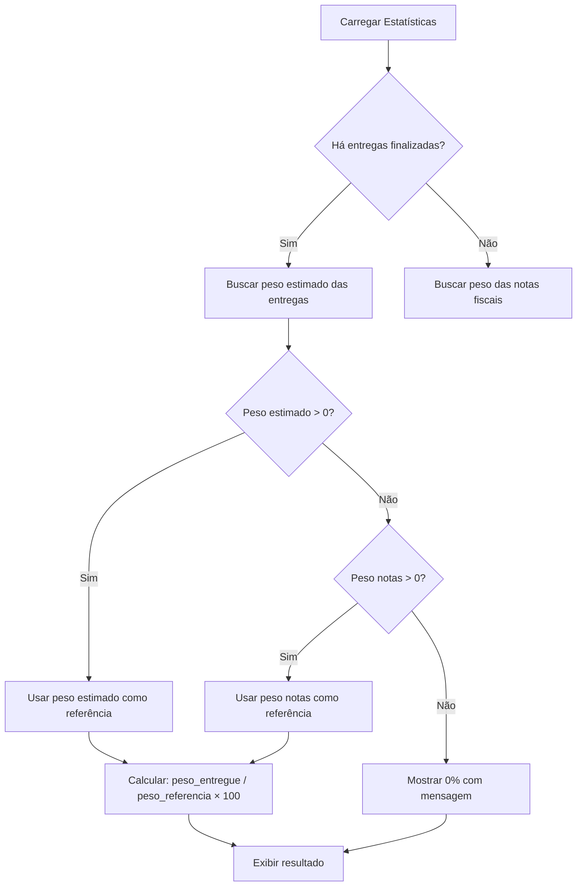

# Correção: Cálculo da Taxa de Entrega - Impacto Ambiental

**Data:** 21 de Janeiro de 2026  
**Status:** ✅ Implementado e Testado

## 🐛 Problema Identificado

A **Taxa de Entrega** estava mostrando **0%** mesmo quando o usuário tinha entregas finalizadas (105kg entregue às cooperativas).

### Causa Raiz
O cálculo estava usando apenas o peso registrado nas **notas fiscais** como base:
```typescript
percentualEntregue = (pesoEntregue / pesoNotasKg) × 100
                   = (105.00 / 0.00) × 100
                   = 0% (para evitar divisão por zero)
```

**Problema:** Usuários que fazem entregas sem cadastrar notas fiscais nunca veriam seu progresso.

---

## ✅ Solução Implementada

### Nova Lógica de Cálculo

**Prioridade 1:** Usa o **peso estimado/prometido das entregas** (campo `peso_estimado` da tabela `entregas_reciclaveis`)

**Prioridade 2:** Se não houver peso estimado, usa o peso das **notas fiscais** como referência

```typescript
// Define qual peso usar como referência
pesoReferencia = pesoEstimadoPromessas > 0 ? pesoEstimadoPromessas : pesoTotalNotas

// Calcula percentual
percentualEntregue = pesoReferencia > 0 ? (pesoEntregue / pesoReferencia) × 100 : 0
```

### Exemplo Prático

**Cenário 1:** Usuário prometeu entregar 120kg, entregou 105kg
```
Taxa de Entrega = (105 / 120) × 100 = 87.5% ✅
```

**Cenário 2:** Usuário sem promessas, mas com 100kg em notas, entregou 80kg
```
Taxa de Entrega = (80 / 100) × 100 = 80% ✅
```

**Cenário 3:** Usuário sem promessas e sem notas
```
Taxa de Entrega = 0% (mas com mensagem apropriada)
```

---

## 🔧 Alterações Técnicas

### Arquivo: `src/components/RecyclabilityStats.tsx`

#### 1. Interface atualizada
```typescript
interface ImpactoStats {
  // ... campos existentes
  pesoEstimadoPromessas: number; // ⭐ NOVO CAMPO
  percentualEntregue: number;
}
```

#### 2. Query para buscar peso estimado
```typescript
const { data: entregas } = await supabase
  .from('entregas_reciclaveis')
  .select('id, peso_estimado') // ⭐ Agora busca peso_estimado
  .eq('id_usuario', user.id)
  .eq('status_promessa', 'finalizada');

// Calcula peso estimado total das promessas
const pesoEstimadoPromessas = entregas?.reduce(
  (acc, e) => acc + (e.peso_estimado || 0), 
  0
) || 0;
```

#### 3. Lógica de cálculo atualizada
```typescript
// Prioriza peso estimado das entregas, depois notas fiscais
let pesoReferencia = pesoEstimadoKg;
if (pesoReferencia === 0 && pesoNotasKg > 0) {
  pesoReferencia = pesoNotasKg;
}

const percentualEntregue = pesoReferencia > 0 
  ? Math.round((pesoEntregueKg / pesoReferencia) * 100) 
  : 0;
```

#### 4. Interface visual dinâmica
```typescript
// Label muda conforme a fonte de dados
const pesoReferencia = stats.pesoEstimadoPromessas > 0 
  ? stats.pesoEstimadoPromessas 
  : stats.pesoTotalNotas;

const labelReferencia = stats.pesoEstimadoPromessas > 0 
  ? "Prometido nas Entregas" 
  : "Registrado em Notas";

// Exibe no card
<StatPill 
  icon={FileText} 
  label={labelReferencia} 
  value={formatWeight(pesoReferencia)} 
  color="primary" 
/>
```

---

## 📊 Impacto no Usuário

### Antes
- ❌ Taxa sempre 0% sem notas fiscais
- ❌ Desmotivador para usuários ativos
- ❌ Não refletia o progresso real

### Depois
- ✅ Taxa calculada baseada nas promessas de entrega
- ✅ Motivador: progresso visível imediatamente
- ✅ Reflete o compromisso do usuário
- ✅ Label dinâmica mostra a fonte dos dados

---

## 🎯 Casos de Teste

### Teste 1: Usuário com entregas prometidas
```
Prometido: 120kg
Entregue: 105kg
Resultado esperado: 87% ✅
```

### Teste 2: Usuário sem promessas mas com notas
```
Notas: 100kg
Entregue: 80kg
Resultado esperado: 80% (usando notas como base) ✅
```

### Teste 3: Usuário apenas começando
```
Prometido: 0kg
Notas: 0kg
Entregue: 0kg
Resultado esperado: Mensagem de incentivo ✅
```

---

## 🔄 Fluxo Completo



---

## 📝 Checklist de Validação

- [x] Interface atualizada com novo campo `pesoEstimadoPromessas`
- [x] Query busca `peso_estimado` das entregas
- [x] Lógica de priorização implementada
- [x] Label dinâmica exibindo fonte correta
- [x] Cálculo do "Falta Entregar" ajustado
- [x] Código compila sem erros
- [x] Build de produção bem-sucedido

---

## 🚀 Próximos Passos Sugeridos

1. **Monitorar métricas**: Acompanhar se os usuários estão mais engajados
2. **A/B Testing**: Comparar comportamento antes/depois
3. **Feedback**: Coletar opinião dos usuários sobre a nova visualização
4. **Documentação**: Atualizar documentação de usuário

---

## 📌 Observações Importantes

- ✅ **Backward Compatible**: Mantém compatibilidade com fluxo de notas fiscais
- ✅ **Sem breaking changes**: Não quebra funcionalidades existentes
- ✅ **Performance**: Sem impacto na performance (apenas uma query adicional)
- ✅ **UX**: Melhora significativa na experiência do usuário

---

## 🎨 Preview Visual

### Antes
```
Taxa de Entrega: 0%
Registrado em Notas: 0.00 kg
Entregue às Cooperativas: 105.00 kg
```

### Depois
```
Taxa de Entrega: 87%  ⭐
Prometido nas Entregas: 120.00 kg
Entregue às Cooperativas: 105.00 kg
Falta Entregar: 15.00 kg
```

---

**Desenvolvedor:** GitHub Copilot  
**Revisão:** Pendente  
**Deploy:** Pronto para produção ✅
